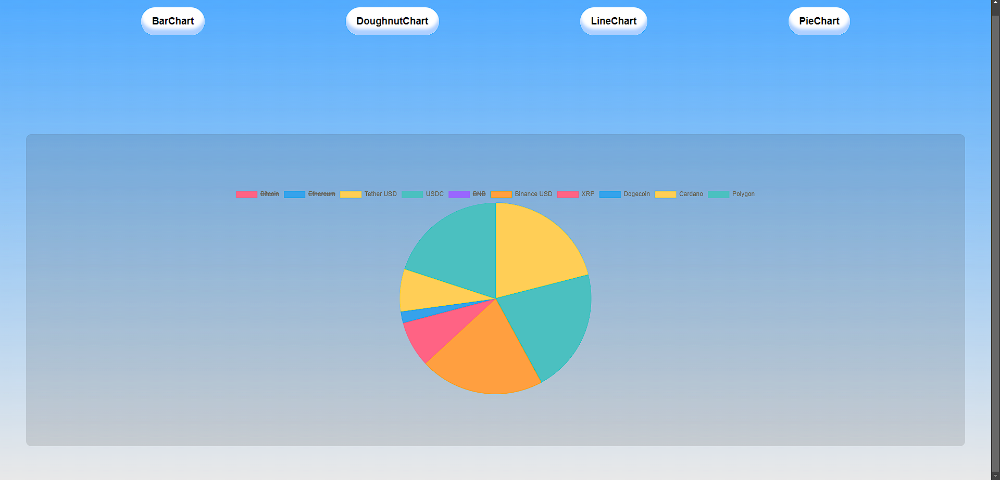
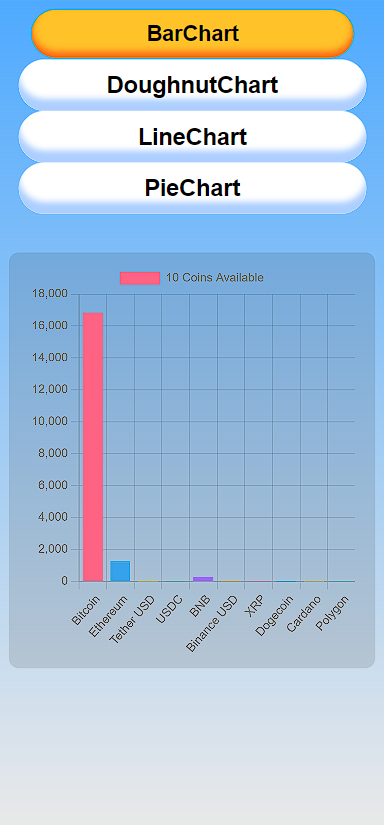

 
<h1>ChartJS React with API</h1>

Activate temporary access for data from api
https://cors-anywhere.herokuapp.com/corsdemo

<h5>Charts JS examples with coinranking API 🥧 (BarChart, DoughnutChart, LineChart, PieChart)</h5>

<h2>Fix CORS</h2>

API - https://developers.coinranking.com/api

